# Bezique Card Game SDK - Development Guidelines

## Project Overview
Building a Bezique Card Game SDK using StateSmith for state machine implementation. The core functionality is defined through PlantUML state diagrams that StateSmith transpiles into C# code.

## Response Format for State Diagrams

When generating or modifying state diagrams, **always** use this exact format:

```plantuml
@startuml

/'! $CONFIG : toml
SmRunnerSettings.transpilerId = "CSharp"
'/

hide empty description

state STATE_NAME {
    STATE_NAME: enter / methodName();
}

[*] -> STATE_NAME

@enduml
```



### Critical Requirements:
1. **Always include** the StateSmith configuration header:
   ```plantuml
   /'! $CONFIG : toml
   SmRunnerSettings.transpilerId = "CSharp"
   '/
   ```

2. **Use exact syntax** for entry/exit behaviors:
   - Correct: `STATE_NAME: enter / methodName();`
   - Correct: `STATE_NAME: exit / cleanup();`
   - Correct: `TRANSITION_NAME / action();`

3. **Valid PlantUML structure**:
   - Proper nesting of composite states
   - Valid transitions (`->`)
   - Terminate with `@enduml`

## Code Generation Responsibilities

For every state diagram that references external methods (e.g., `enter / adapter.NotifyAll();`), you must:

1. **Define the interface** that the state machine depends on
2. **Implement the interface** with concrete class(es)
3. **Handle all method signatures** referenced in the state diagram

### Example:
If state diagram contains: `enter / adapter.NotifyAll();`

You must provide:
```csharp
// Interface
public interface IGameAdapter
{
    void NotifyAll();
}

// Implementation
public class GameAdapter : IGameAdapter
{
    public void NotifyAll()
    {
        // Implementation logic
    }
}
```

## Development Workflow

1. **State Diagram First**: Design/modify the PlantUML state diagram
2. **Generate State Machine**: StateSmith transpiles the diagram to C#
3. **Supporting Code**: Create interfaces and implementations for external method calls
4. **Validation**: Ensure generated code compiles and functions correctly

## Code Quality Standards

- **Valid StateSmith syntax**: No malformed transitions or state definitions
- **Type safety**: All method signatures must match their usage in state diagrams
- **Separation of concerns**: State machines handle flow; external code handles business logic
- **No guesswork**: If uncertain about StateSmith syntax, verify before generating

## Bezique Game Context

This is a card game SDK. Key concepts:
- **GAME_STARTED**: Initial game state
- **ENOUGH_CARD_GAME**: Standard gameplay phase
- **LAST_9_CARD_GAME**: Endgame phase
- **Turn-based flow**: Players take turns, tricks are won, cards are drawn

Keep the game rules in mind when designing state transitions.

---

**Always respond with:**
1. Valid PlantUML state diagram code (if applicable)
2. All necessary C# interfaces and implementations
3. Clear explanations of changes made
4. File paths for created/modified files
